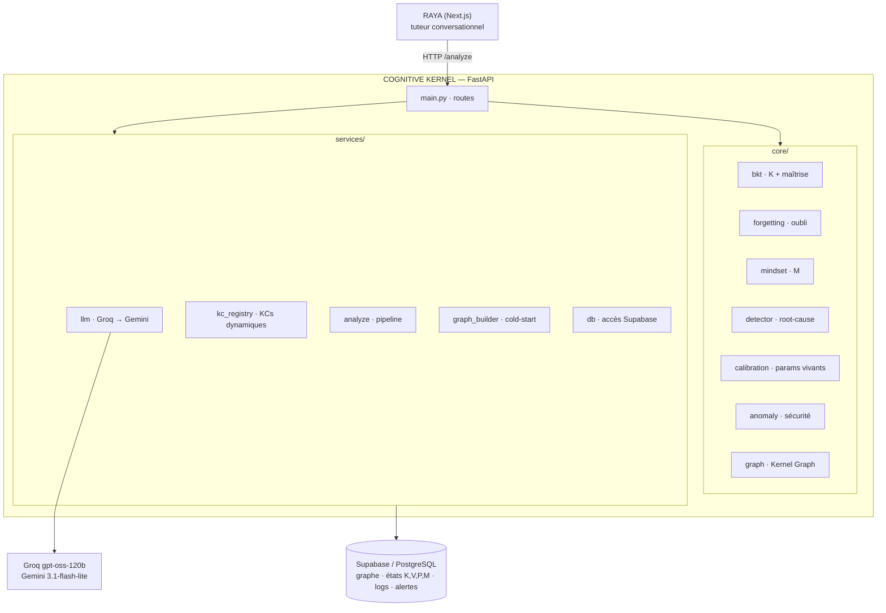
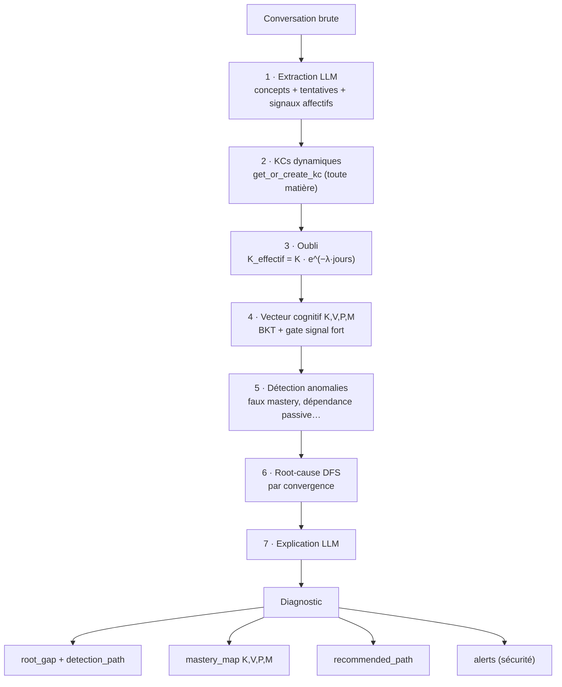
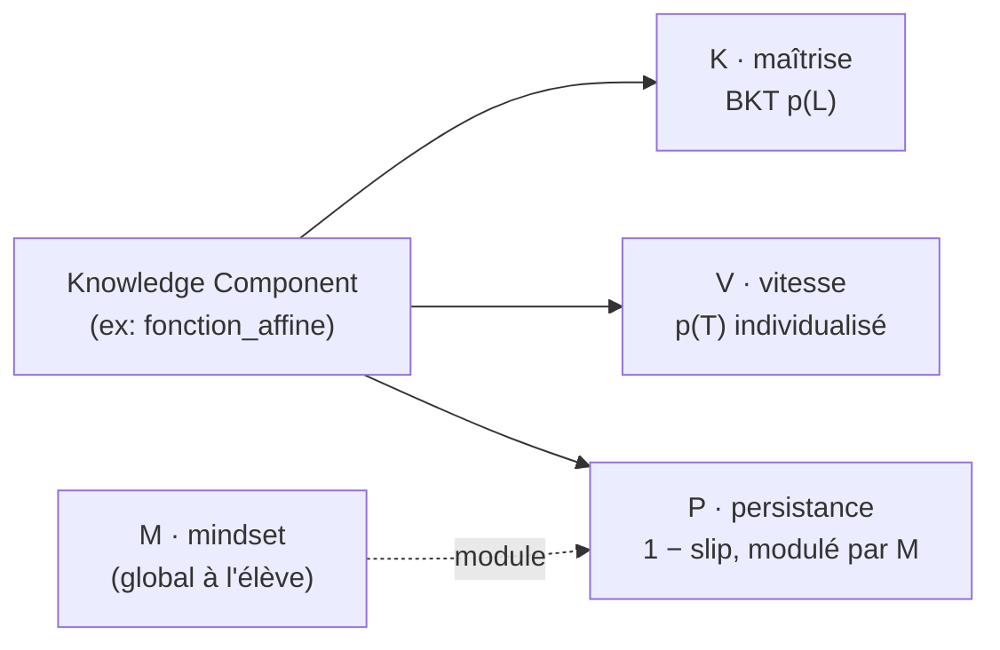
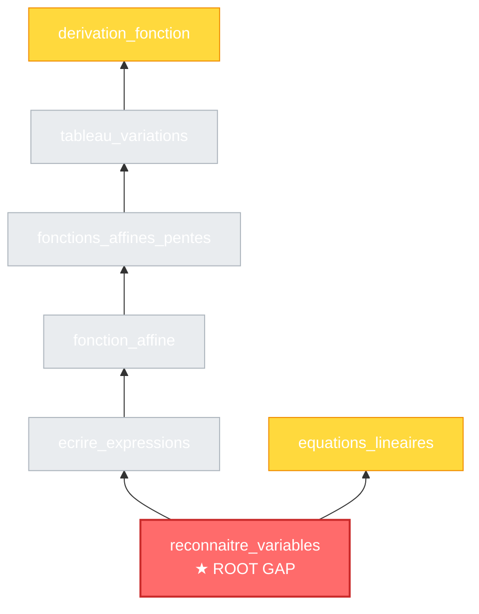
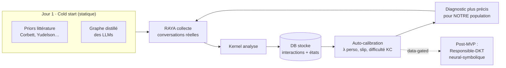
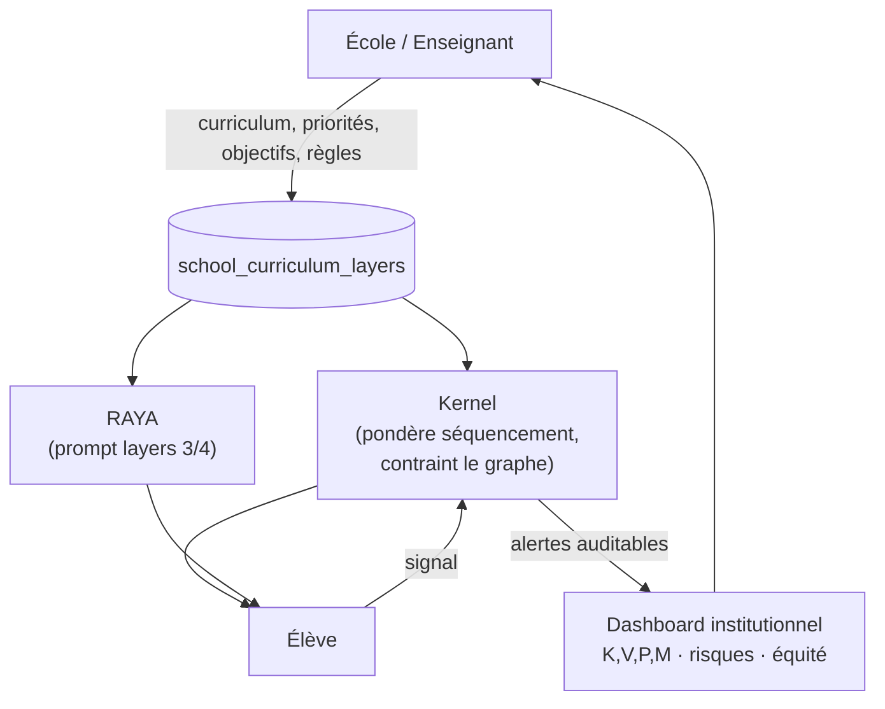

# Bluestift Cognitive Kernel — Diagrams

Visual schemas of the Kernel. Mermaid renders natively on GitHub and in most deck
tools (Notion, Obsidian, mermaid.live → export PNG/SVG for slides).

---

## 1. System architecture

---

## 2. The /analyze pipeline (step by step)

---

## 3. The cognitive vector (per student × per KC)

---

## 4. Root-cause detection by convergence

Deux concepts échoués (`derivation_fonction`, `equations_lineaires`) **convergent**
sur une même lacune fondamentale → c'est la racine, même si ce n'est pas la chaîne
la plus longue. (Arête = prérequis → concept.)

- 🟡 **fail** = l'élève échoue (preuve directe)
- ⬜ **unknown** = jamais pratiqué, traversé par le DFS (suspect)
- 🔴 **root** = lacune racine retenue (convergence + preuve + profondeur)

---

## 5. The flywheel — static priors → dynamic, self-calibrating

---

## 6. School → AI → Student channel (post-MVP differentiator)

