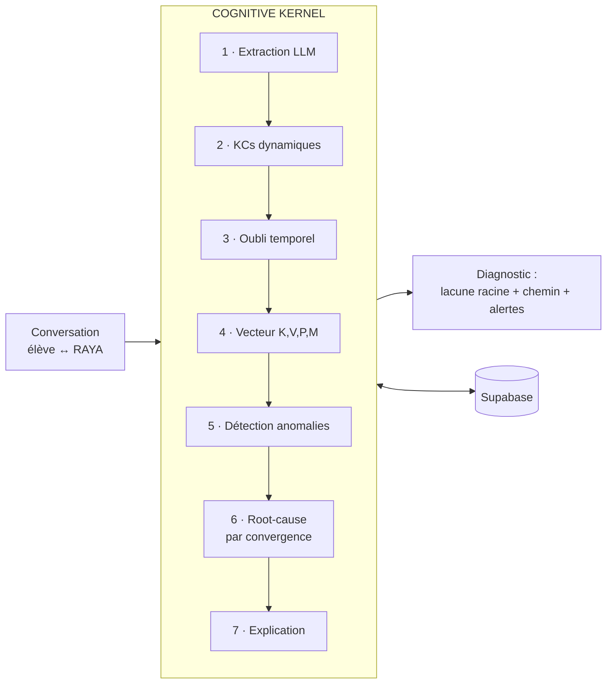
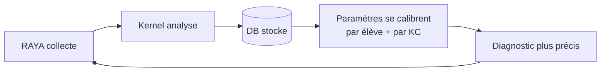

# Bluestift Cognitive Kernel — One-Pager

> Le cerveau cognitif qui diagnostique **pourquoi** un élève bloque, pas juste **où**.

---

## Le problème
Les outils d'IA éducative disent à l'élève ce qu'il rate (*« tu échoues aux dérivées »*) —
ce qu'il sait déjà. Ils ne disent pas **pourquoi**. Et sans garde-fous, un tuteur IA
**détruit l'apprentissage** : −17 % à l'examen (Bastani, RCT ~1000 élèves).

## La solution
Un service autonome (le **Kernel**) qui, à partir d'une conversation élève↔tuteur,
remonte la **chaîne de prérequis** jusqu'à la **lacune fondamentale**, modélise la
**psychologie** de l'élève, et **s'auto-améliore** à chaque interaction.

> *« Tu bloques sur les dérivées parce qu'en remontant, reconnaître une variable n'est pas solide. »*

## Comment ça marche

Pour **chaque élève × chaque concept**, le Kernel trace 4 dimensions :

| K | V | P | M |
|---|---|---|---|
| Maîtrise | Vitesse d'apprentissage | Persistance | Mindset |

→ **Cognitif × affectif** : la plupart des edtech ne tracent que K.

## Statique ou dynamique ?
**Dynamique.** Les priors de la recherche ne sont qu'un *point de départ*. Dès que de
vrais élèves interagissent, les paramètres se **recalibrent sur notre population** :

**Aujourd'hui** : BKT bayésien interprétable, marche dès le jour 1, auditable.
**Demain** (data-gated) : Responsible-DKT neural-symbolique (AUC ~0.90).

## Le moat
1. **Cause racine**, pas symptôme (détection par convergence).
2. **Cognitif × affectif** (K, V, P, M).
3. **Sécurité pédagogique** auditable (faux mastery, dépendance passive, surcharge, mindset).
4. **Flywheel de données** : calibré sur le contexte **subsaharien** — là où tous les
   modèles existants sont nord-américains. **Incopiable sans nos données.**
5. **Graphe ouvert**, toute matière, auto-généré + auto-étendu.

## Traction technique
✅ **v1 complet et déployé** (Railway, HTTPS) · 30 tests · 8 migrations · détection
profonde vérifiée de bout en bout · graphe MATH dense auto-généré.

## La suite
**Intégration RAYA** (allume le flywheel) → canal **école→IA→élève** (différenciateur
institutionnel) → Responsible-DKT quand la donnée s'accumule. Voir `POST_MVP_ROADMAP.md`.

## La cible
**Bloom 2-sigma** : l'élève moyen tutoré dépasse 98 % de ses pairs. Applicable à
**200 M d'élèves subsahariens** sans accès à un tuteur individuel.
