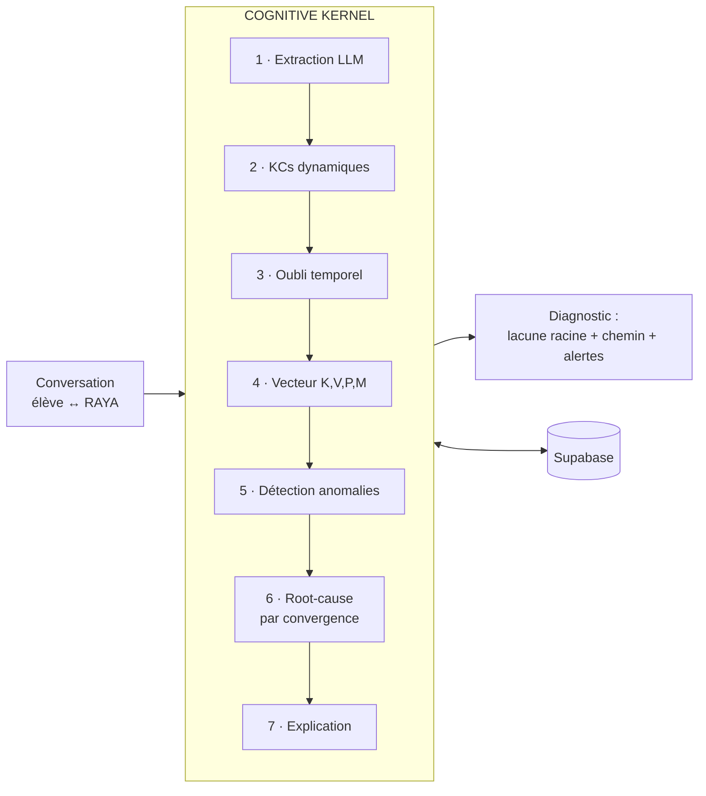
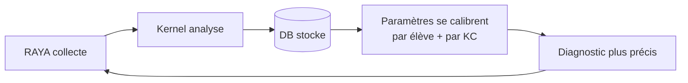

# Bluestift Cognitive Kernel — One-Pager

> Le cerveau cognitif qui diagnostique **pourquoi** un élève bloque, pas juste **où**.

---

## Le problème
Les outils d'IA éducative disent à l'élève ce qu'il rate (*« tu échoues aux dérivées »*) —
ce qu'il sait déjà. Ils ne disent pas **pourquoi**. Et sans garde-fous, un tuteur IA
**nuit à l'apprentissage** : −17 % à l'examen (Bastani et al. 2024, RCT ~1000 élèves).
Avec des garde-fous, la perte disparaît — mais sans gain : éviter le mal ne suffit
pas, il faut savoir *quoi* enseigner à *cet* élève.

## La solution
Un service autonome (le **Kernel**) qui, à partir d'une conversation élève↔tuteur,
remonte la **chaîne de prérequis** jusqu'à la **lacune fondamentale**, modélise la
**psychologie** de l'élève, et **s'auto-améliore** à chaque interaction.

> *« Tu bloques sur les dérivées parce qu'en remontant, reconnaître une variable n'est pas solide. »*

## Comment ça marche

```mermaid
flowchart LR
    C["Conversation<br/>élève ↔ RAYA"] --> K
    subgraph K["COGNITIVE KERNEL"]
      direction TB
      E["1 · Extraction LLM"] --> G["2 · KCs dynamiques"]
      G --> F["3 · Oubli temporel"]
      F --> B["4 · Vecteur K,V,P,M"]
      B --> A["5 · Détection anomalies"]
      A --> D["6 · Root-cause<br/>par convergence"]
      D --> S["7 · Explication"]
    end
    K --> O["Diagnostic :<br/>lacune racine + chemin + alertes"]
    K <--> DB[("Supabase")]
```

Pour **chaque élève × chaque concept**, le Kernel trace 4 dimensions :

| K | V | P | M |
|---|---|---|---|
| Maîtrise | Vitesse d'apprentissage | Persistance | Mindset |

→ **Cognitif × affectif** : la plupart des edtech ne tracent que K.

## Statique ou dynamique ?
**Dynamique.** Les priors de la recherche ne sont qu'un *point de départ*. Dès que de
vrais élèves interagissent, les paramètres se **recalibrent sur notre population** :

```mermaid
flowchart LR
    R["RAYA collecte"] --> K["Kernel analyse"]
    K --> DB[("DB stocke")]
    DB --> CAL["Paramètres se calibrent<br/>par élève + par KC"]
    CAL --> P["Diagnostic plus précis"]
    P --> R
```

**Aujourd'hui** : BKT bayésien étendu (oubli, crédit partiel, aide, paramètres
recalibrés par EM sur nos élèves), interprétable, auditable, fonctionnel dès le jour 1.
Un BKT étendu rivalise avec le deep knowledge tracing sur les benchmarks publics
(Khajah et al. 2016).
**Demain** (data-gated) : un modèle hybride neuro-symbolique — seulement s'il bat
le BKT étendu sur nos propres données.

## Le moat
1. **Cause racine**, pas symptôme (détection par convergence).
2. **Cognitif × affectif** (K, V, P, M).
3. **Sécurité pédagogique** auditable (faux mastery, dépendance passive, surcharge, mindset).
4. **Flywheel de données** : calibré sur le contexte **subsaharien** — là où les
   modèles existants sont calibrés sur des données nord-américaines, européennes
   ou asiatiques. **Incopiable sans nos données.**
5. **Graphe ouvert**, toute matière, auto-généré + auto-étendu.

## Traction technique
✅ **v1 complet et déployé** (Railway, HTTPS) · 147 tests · 12 migrations · graphe
MATH dense auto-généré.

**Mesuré, pas affirmé** — banc d'élèves synthétiques à lacune connue, passés par le
vrai pipeline (3 sessions, extraction supposée parfaite) : après l'audit du
2026-09-30, **précision ×2** (15–22 % → 36–41 %), **fausses alertes sur élèves sans
lacune : ~100 % → 8–17 %**. Puis le **sondage actif** (2026-10-01) : le Kernel
choisit la question qui tranche le mieux où est la lacune ; lacune exacte trouvée
**56–64 %** (contre 35–40 %), précision **58–65 %**, avec moins de questions qu'un
tirage au hasard qui fait moins bien.

## La suite
**Intégration RAYA** (allume le flywheel) → canal **école→IA→élève** (différenciateur
institutionnel) → Responsible-DKT quand la donnée s'accumule. Voir `POST_MVP_ROADMAP.md`.

## La cible
**Bloom 2-sigma** (1984) : l'élève moyen tutoré dépasse 98 % de ses pairs. C'est une
cible, pas une promesse : les méta-analyses récentes mesurent +0.4 à +0.8 σ pour le
tutorat humain et les meilleurs tuteurs intelligents (VanLehn 2011 ; Nickow et al.
2020). Applicable à **200 M d'élèves subsahariens** *(chiffre à sourcer)* sans accès
à un tuteur individuel.
